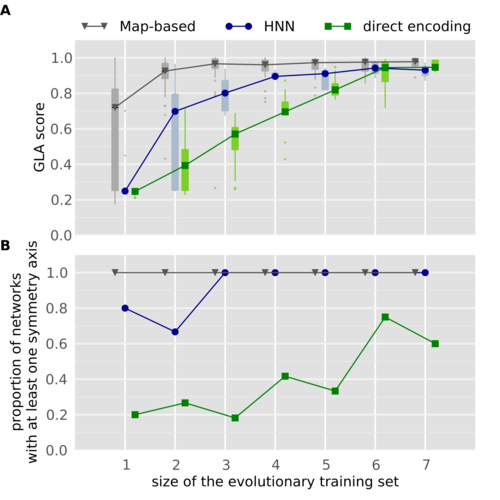
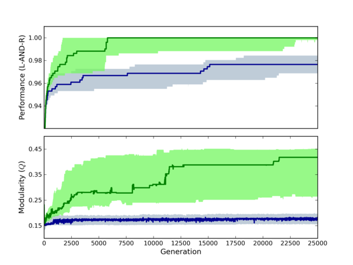
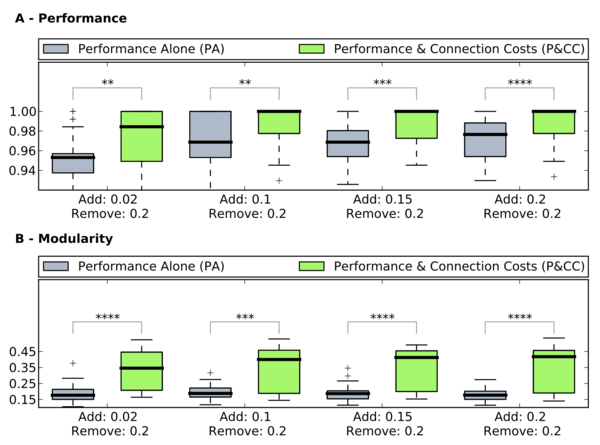
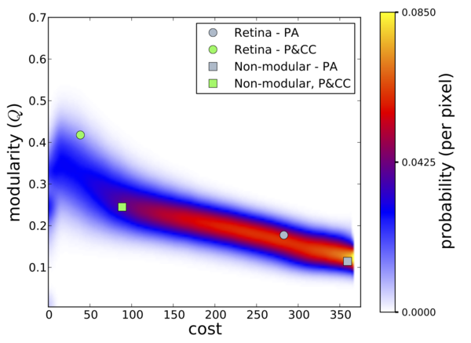
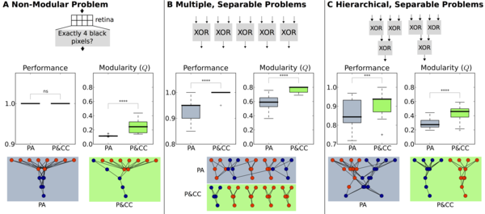

====================================================
Creating publication-quality figures with Matplotlib
====================================================

-------------------------------------------------------------------------------
Jean-Baptiste Mouret -- mouret@isir.upmc.fr / http://pages.isir.upmc.fr/~mouret
-------------------------------------------------------------------------------

.. contents::
   :local:
   :depth: 2

Introduction
============

This repository contains the handout (and the source of the handout) for the tutorial "Creating publication-quality with Python and Matplotlib", given at the `Alife 2014 conference <http://blogs.cornell.edu/alife14nyc/>`_.

Contributions are welcomed: feel free to clone and send pull requests.

Goal
----
- Create nice figures for scientific papers
- Specific focus on the needs for artificial life and evolutionary computation (use cases: fitness over time, box plot to compare two treatments)
- **From the basics to the useful advanced features**: I will not only explains the basics: I will guide you until you get a modern, publication-quality figure.
- I will not try to cover every possible plots or every options: this tutorial is not a replacement for the documentation or the already existing tutorials.

For another tutorial about "good" design with matplotlib: http://nbviewer.ipython.org/gist/olgabot/5357268 ; most of the suggested best practices have been incorporated in `prettyplotlib <http://olgabot.github.io/prettyplotlib/>`_, an add-on to matplotlib. We are not using this library here because our goal is to teach how to customize matplotlib to your own needs, but many of our suggestion are similar to those performed by prettyplotlib.

**Design is always a personal choice**: do your own choices, but take the time to learn the current best practices before choosing to ignore them!

For a more classic and general introduction to matplotlib, check the nice tutorial made by N. Rougier: http://www.labri.fr/perso/nrougier/teaching/matplotlib/

For some inspiration about what is possible, check:
 
- the Matplotlib gallery: http://matplotlib.org/gallery.html
- the Matplotlib examples: http://matplotlib.org/1.3.1/examples/
- another gallery: https://github.com/rasbt/matplotlib-gallery
- and another one: http://nbviewer.ipython.org/github/cs109/content/blob/master/lec_03_statistical_graphs.ipynb

Examples of figures:

.. admonition:: Reference

 Tonelli, Paul, and Jean-Baptiste Mouret. "On the relationships between generative encodings, regularity, and learning abilities when evolving plastic artificial neural networks." *PloS one* 8.11 (2013): e79138.

 

.. admonition:: Reference

 Clune*, Jeff, Jean-Baptiste Mouret*, and Hod Lipson. "The evolutionary origins of modularity." *Proceedings of the Royal Society B: Biological sciences 280.1755 (2013): 20122863* [\*: equal contribution].

What is Matplolib?
------------------
Principle
.........
.. admonition:: URL

 * http://matplotlib.org/
 * http://www.numpy.org/

- Library based on Python (easy) and compatible with numpy (powerful math library for Python):

 + Python script -> pdf/svg/png file
 + can be used with ipython (interactive use)
 + can use everything from Python (libraries): **numpy, stat packages, low-level functions, file loaders, ...**
 + => Everything is possible! (but it sometimes requires some effort)

- portable
- open source (GPL)

Installation
............
- OSX: install brew, then use it to install pip, and use pip to install matplotlib (!).

.. code:: bash

 # install brew:
 ruby -e "$(curl -fsSL https://raw.github.com/Homebrew/homebrew/go/install)"
 # matplotlib will need freetype
 brew install freetype
 # pip is a package manager for python: https://pypi.python.org/pypi
 brew install pip
 # now use pip to install matplotlib
 pip install numpy
 pip install matplotlib

More info / alternative approaches: 
 - you can install Canopy Express (full python environment for scientists): https://store.enthought.com/
 - http://www.tapir.caltech.edu/~dtsang/python.html
 - http://penandpants.com/2012/02/24/install-python/

- Debian / Ubuntu: 

.. code:: bash
 
 sudo apt-get install python-matplotlib

- Windows: install `Canopy Express <https://store.enthought.com/>`_

Alternatives
............

Gnuplot:
 - easy to use
 - open source (GPL)
 - hard to do "complicated things"
 - cannot pre-process your data (you need another script for this)

Matlab:
 - expensive
 - closed-source
 - does not deal very well with vector formats (SVG, PDF, EPS, etc.)

R (ggplot2):
 - open source
 - steep learning curve, sometimes not very flexible

Basics
======

*In most cases, click on the image to get the corresponding source code*

Your first plot
---------------
.. admonition:: How to test?

 - launch *ipython --pylab* and copy-paste the script (interactive use)
 - **or** save the script in a file and execute it with *python*
 - **You can access to the source code by clicking on the figure**

.. include:: src/example1.py
    :code: python

.. code:: python
 
 # Pylab includes numpy as 'np'
 from pylab import *

 # create an array of 256 points (x), from -pi to +pi
 x = np.linspace(-np.pi, np.pi, 256)

 # compute cos(x) [thanks to numpy, cos(x) returns an array]
 y = np.cos(x)

 # compute the plot
 plot(x, y)

 # Show it in a new window
 show()

.. Image:: figs/first_plot.png
   :align: right
   :target: src/example1.py

The *show()* function will create an interactive window in which you can zoom, move, and save the plot. If you want to save the plot to a file, use the function *savefig('filename.extension')* (Note: the function *savefig* must be called before function *show* if you call both functions). For example, to save our plot to a png file:

.. include:: src/example1_bis.py
    :code: python

.. code:: python
 # Pylab includes numpy as 'np'
 from pylab import *

 # create an array of 256 points (x), from -pi to +pi
 x = np.linspace(-np.pi, np.pi, 256)

 # compute cos(x) [thanks to numpy, cos(x) returns an array]
 y = np.cos(x)

 # compute the plot
 plot(x, y)

 # save in test.png (use test.pdf for a pdf file)
 savefig("test.png")

Typical supported formats are (the exact list depends on the backend):
 
- pdf (vector format, useful for LaTeX papers compiled with pdflatex: no problem of resolution)
- svg (vector format, useful to edit the graph with inkscape or Adobe Illustrator)
- eps (vector format, useful for LaTeX papers compiled with the basic latex: no problem of resolution)
- png (loseless bitmap)
- jpg (do not use for plots)
- gif (do not use for plots)

Plotting some data
------------------
Matplotlib does not provide anything to load data from a file. However, since we are using python, we can use the standard methods to read a file. For instance, to read a file called "file.dat", which contains:

::

 2.3
 1.5
 1.2
 4
 5
 9

We can use a simple loop (this approach is useful if your file is not a pure array of numbers, or if you want to skip some lines, etc.):

.. code:: python
 
 data = []
 for line in open('file.dat'):
   data += [float(line)]
 # to check
 print data

But we can also use numpy (one line of code):

..  code:: python

 # this will load numpy for us 
 from pylab import *
 
 # load the file and store the result in data
 data = np.loadtxt('file.dat')
 print data

.. Image:: figs/example2.png
   :align: right
   :target: src/example2.py

To plot the data, we use the same plot function as before. Don't forget to call *show()* if you want to see the plot on your screen (or *savefig()* if you want to save the plot).

.. include:: src/example2.py
    :code: python

.. code:: python
 # this will load numpy for us
 from pylab import *

 # load the file and store the result in data
 data = np.loadtxt('file.dat')

 # generate a x array of the size of the file
 x = np.arange(0, len(data))

 # plot
 plot(x, data)
 show()

.. Image:: figs/example2_bis.png
   :align: right
   :target: src/example2_bis.py

To plot several lines, just call plot several times (the color is automatically selected). We add a label to identify each plot and call *legend()* to add a legend.

.. include:: src/example2_bis.py
    :code: python

.. code:: python
 # this will load numpy for us
 from pylab import *

 # load the file and store the result in data
 data = np.loadtxt('file.dat')
 data2 = np.loadtxt('file2.dat')

 # generate a x array of the size of the file
 x = np.arange(0, len(data))

 # plot
 plot(x, data, label='data1')
 plot(x, data2, label='data2')
 legend()
 savefig('example2_bis.png')

Changing the color and the type of line
----------------------------------------
.. admonition:: More

 - `Change the markers <http://matplotlib.org/examples/pylab_examples/line_styles.html>`_
 - `HTML color picker <http://www.w3schools.com/tags/ref_colorpicker.asp>`_

.. include:: src/example1_color.py
    :code: python

.. code:: python

 from pylab import *

 x = np.linspace(-np.pi, np.pi, 256)
 y = []
 for i in range(0, 7):
  y += [np.cos(x + i)]

 plot(x, y[0], color='red', linewidth=2.5, linestyle='-', label='linestyle="_"')
 plot(x, y[1], color='blue', linewidth=5, alpha=0.5, linestyle='-', label='lines tyle="-"')
 plot(x, y[2], color='#aa0000', linewidth=1, linestyle='--', label='linestyle="--"')
 plot(x, y[3], color='black', linestyle=':', label='linestyle=":"')
 plot(x, y[4], color='black', linewidth=2, linestyle='-.', label='linestyle="-."')

 legend()
 savefig('example1_color.png')

.. Image:: figs/example1_color.png
   :align: right
   :target: src/example1_color.py

- Available linestyles: '_', '-', ':', '-.'
- Available colors:

 + basic names ("red", "blue", etc.)
 + HTML names ("#FF0000", ...)
 + grayscale values ("0.9")

Setting the limits and the ticks
---------------------------------

.. admonition:: Documentation

 * `xticks() command <http://matplotlib.sourceforge.net/api/pyplot_api.html#matplotlib.pyplot.xticks>`_
 * `yticks() command <http://matplotlib.sourceforge.net/api/pyplot_api.html#matplotlib.pyplot.yticks>`_
 * `set_xticklabels() <http://matplotlib.sourceforge.net/api/axes_api.html?#matplotlib.axes.Axes.set_xticklabels>`_
 * `set_yticklabels() <http://matplotlib.sourceforge.net/api/axes_api.html?#matplotlib.axes.Axes.set_yticklabels>`_

Changing the limits:

.. code:: python

 xlim(min_value, max_value)
 ylim(min_value, max_value)
 
The *ticks*:

.. code:: python

 # with automatic labeling
 xticks(list_of_ticks_positions)
 yticks(list_of_ticks_positions)

 # with custom labels
 xticks(list_of_ticks, list_of_labels)
 yticks(list_of_ticks, list_of_labels)

.. Image:: figs/example2_lims.png
   :align: right
   :target: src/example2_lims.py

Example:

.. include:: src/example2_lims.py
    :code: python

.. code:: python

 # this will load numpy for us
 from pylab import *
 data = np.loadtxt('file.dat')
 x = np.arange(0, len(data))

 #change the limits
 xlim(1.5, 3.4)
 ylim(-2, 4)

 #ticks
 xticks([0, 1, 2, 3], ['T0', 'T1', 'T2', 'T3'])
 # use np.arange to generate the array of ticks
 yticks(np.arange(-2, 4, 0.5))

 plot(x, data)
 savefig('example2_lims.png')

Data over time
==============

Use case
--------
- You launched an evolutionary algorithm 30 times (in our case, we used `sferes2 <http://github.com/jbmouret/sferes2>`_)
- You want to see the *median maximum fitness* of all the runs, for each generation
- You want to see the first and third quartiles
- You want to see another data set (e.g. the median modularity) at the same time for each generation

Basics
------
Loading the data
................
You can download the data used in this example `by following this link <http://chronos.isir.upmc.fr/~mouret/alife_matplotlib/src/data/data.tar.gz>`_.

Our data are organized as follows:

::

 data/high_mut/exp_0/node10_2014-07-15_16_42_46_18276/bestfit.dat
 data/high_mut/exp_1/node09_2014-07-15_16_42_46_7728/bestfit.dat
 data/high_mut/exp_10/node11_2014-07-15_16_42_48_27645/bestfit.dat
 data/high_mut/exp_11/node08_2014-07-15_16_42_48_8689/bestfit.dat
 data/high_mut/exp_12/node09_2014-07-15_16_42_48_7770/bestfit.dat
 [...]
 data/low_mut/exp_0/node04_2014-07-15_16_42_46_11616/bestfit.dat
 data/low_mut/exp_1/node10_2014-07-15_16_42_46_18277/bestfit.dat
 data/low_mut/exp_10/node11_2014-07-15_16_42_48_27642/bestfit.dat
 data/low_mut/exp_11/node02_2014-07-15_16_42_48_19205/bestfit.dat
 data/low_mut/exp_12/node08_2014-07-15_16_42_48_8693/bestfit.dat
 data/low_mut/exp_13/node07_2014-07-15_16_42_49_31387/bestfit.dat

For each line of each bestfit.dat, we have the generation and the fitness of the best individual:

::

 0 -4026.84
 1 -4026.84
 2 -4026.84
 3 -4026.84
 4 -4026.84
 5 -4026.84
 6 -4026.84
 7 -4026.84
 8 -4026.84
 9 -4026.84
 10 -4026.84
 [...]

.. admonition:: Documentation

  - `glob() <https://docs.python.org/2/library/glob.html>`_

Let first load the data. We can use the *glob* module, from python, to get the list of relevant files:

.. include:: src/load_data.py
    :code: python

.. code:: python

 # glob allows us to list the files that match a pattern
 import glob

 # pylab will be useful later
 from pylab import *

 # a simple function to load our files
 def load(dir):
     # example : exp_9/node05_2014-07-15_16_42_48_5178/bestfit.dat
     f_list = glob.glob(dir + '/*/*/bestfit.dat')
     d = []
     for f in f_list:
         d += [np.loadtxt(f)]
     return d

 # load our data
 data_low_mut = load('data/low_mut')
 data_high_mut = load('data/high_mut')

 print data_low_mut
 print data_high_mut

Median vs Mean
--------------

 Using the mean + standard deviation assumes that your data are *normally distributed*. This assumption is usually wrong in evolutionary computation (and in experimental computer science). For instance, your algorithm may fail 30% of the time (fitness = 0) and succeed 70% of the time (fitness = 1): you have two peaks and the distribution is not Gaussian at all. In addition, the standard deviation assumes that the distribution is symmetric, which is clearly not the case when there is a maximum that cannot be exceeded.

 **You should always use the median and the 25% / 75% percentiles, unless you have good reason to think that your data are normally distributed**.

However, our goal is to compute the median over all the runs, at each generation. We therefore need to re-organize the data to make this operation easy. We will re-organize the data in a matrix like this one:

+-------+-------+------+------+---+-------+
|       | Gen 1 | Gen 2| Gen 3|...| Gen n |
+=======+=======+======+======+===+=======+
| Run 1 |       |      |      |   |       |
+-------+-------+------+------+---+-------+
| [...] |       |      |      |   |       |
+-------+-------+------+------+---+-------+
| Run k |       |      |      |   |       |
+-------+-------+------+------+---+-------+

.. include:: src/load_data2.py
    :code: python

.. code:: python

 # glob allows us to list the files that match a pattern
 import glob

 # pylab will be useful later
 from pylab import *

 # a simple function to load our files
 # we assume that each file has the same number of rows (generations)
 def load(dir):
     # example : exp_9/node05_2014-07-15_16_42_48_5178/bestfit.dat
     f_list = glob.glob(dir + '/*/*/bestfit.dat')
    
     # get the number of lines of the first file, to know the size of the matrix
     num_lines = sum(1 for line in open(f_list[0]))
  
     # be careful that np.zeros takes a tuple as argument (size1, size)
     # therefore we need two parentheses
     i = 0;
     data = np.zeros((len(f_list), num_lines)) 

     for f in f_list:
         # we ignore the first column of the file        
         data[i, :] = np.loadtxt(f)[:,1]
         i += 1
     return data

 # load our data
 data_low_mut = load('data/low_mut')
 data_high_mut = load('data/high_mut')
 print data_low_mut

.. admonition:: Documentation

  - `np.median() <http://docs.scipy.org/doc/numpy/reference/generated/numpy.median.html>`_

Now the data are nicely formatted, we can compute medians an plot them.

.. Image:: figs/medians1.png
   :align: right
   :target: src/plot_median.py

.. include:: src/plot_median.py
    :code: python

.. code:: python

 import glob
 from pylab import *

 def load(dir):
     f_list = glob.glob(dir + '/*/*/bestfit.dat')
     num_lines = sum(1 for line in open(f_list[0]))
     i = 0;
     data = np.zeros((len(f_list), num_lines)) 
     for f in f_list:
         data[i, :] = np.loadtxt(f)[:,1]
         i += 1
     return data

 # compute the median of each column
 def med(data):
     median = np.zeros(data.shape[1])
     for i in range(0, len(median)):
         median[i] = np.median(data[:, i])
     return median

 data_low_mut = load('data/low_mut')
 data_high_mut = load('data/high_mut')

 # generate the x
 n_generations = data_low_mut.shape[1]
 x = np.arange(0, n_generations)

 # compute the medians
 med_low_mut = med(data_low_mut)
 med_high_mut = med(data_high_mut)

 plot(x, med_low_mut)
 plot(x, med_high_mut)

 savefig('medians1.png')

We can use *xlim* and *lim* to see a bit better:

.. code:: python
 
 xlim(-5, 400)
 ylim(-5000, 100)

.. Image:: figs/medians2.png
   :target: src/plot_median2.py

Minimizing ink
--------------
.. Image:: figs/tufte_book_cover.png
   :align: left

Probably the most influential book about data vizualization: 

Tufte, Edward R. *The visual display of quantitative information.*, 2nd edition, Cheshire, CT: Graphics press, 2001.

Main principle: maximize the data / ink ratio. In other words, minimize the visual clutter, or remove everything that is not useful to understand the data.

Example of bad vizualizations:
 - http://joeloughton.com/blog/wp-content/uploads/2011/04/chart13.gif [from: http://joeloughton.com/blog/]
 - http://www.forbes.com/sites/naomirobbins/2012/05/30/winner-of-the-bad-graph-contest-announced-2/

Examples of a better vizualization (according to Tufte):
 - http://www.edwardtufte.com/bboard/q-and-a-fetch-msg?msg_id=00014g
 - http://infosthetics.com/archives/2010/03/obama_loves_infographics.html
 - http://joeloughton.com/blog/visualisations/tufte-bar-chart-redesign-in-jquery-flot/
 - http://blog.revolutionanalytics.com/2010/03/white-house-taps-edward-tufte-to-explain-the-stimulus.html

A publication-quality figure
----------------------------

	 
We first play with the parameters to get the size right:

.. code:: python

 params = {
    'axes.labelsize': 8,
    'text.fontsize': 8,
    'legend.fontsize': 10,
    'xtick.labelsize': 10,
    'ytick.labelsize': 10,
    'text.usetex': False,
    'figure.figsize': [4.5, 4.5]
    }
 rcParams.update(params)

We do not really care about the exact size when our goal is to export a pdf or an eps (for LaTeX) because they are vector formats. However, we care about the ratio (length/width). Moreover, changing the size of the figure will affect the relative size of the fonts.

As a rule of thumb, the font size of your labels should be close to the font size of the figure's caption.

It is also a good idea to increase the linewidths, to be able to make the figure small:

.. code:: python

 plot(x, med_low_mut, linewidth=2, color='#B22400')
 plot(x, med_high_mut, linewidth=2, linestyle='--', color='#006BB2')

And don't forget to add a caption. The parameter *loc* determines the position (1=top right, 2=top left, 3=bottom left, 4=bottom right). We can make the legend a bit prettier by removing the frame and putting a gray background.

.. code:: python

 legend = legend(["Low mutation rate", "High Mutation rate"], loc=4);
 frame = legend.get_frame()
 frame.set_facecolor('0.9')
 frame.set_edgecolor('0.9')

We might also want to remove some ticks, to lighten the figure.

.. code:: python
 
 xticks(np.arange(0, 500, 100))

Last, we can make the figure a bit lighter by removing the frame and adding a light grid:

.. code:: python

  # put this _before_ the calls to plot and fill_between
  axes(frameon=0)
  grid() 

.. Image:: figs/medians3.png
   :target: src/plot_medians3.py
   :align: right

Adding quartiles
----------------

.. admonition:: Documentation

  - `Quartiles (Wikipedia) <http://en.wikipedia.org/wiki/Quartile>`_
  - `percentile() (numpy) <http://docs.scipy.org/doc/numpy-dev/reference/generated/numpy.percentile.html>`_

	 
Quartiles are computed with numpy in the same way as the median, but using the function *percentile*.

.. code:: python

 def perc(data):
    median = np.zeros(data.shape[1])
    perc_25 = np.zeros(data.shape[1])
    perc_75 = np.zeros(data.shape[1])
    for i in range(0, len(median)):
        median[i] = np.median(data[:, i])
        perc_25[i] = np.percentile(data[:, i], 25)
        perc_75[i] = np.percentile(data[:, i], 25)
    return median, perc_25, perc_75

  [...]
  
 # compute the medians and 25/75 percentiles
 med_low_mut, perc_25_low_mut, perc_75_low_mut = perc(data_low_mut)
 med_high_mut, perc_25_high_mut, perc_75_high_mut = perc(data_high_mut)

We will use the function *fill_between* to display the quartiles on our plot. We use alpha=0.25 to get a nice transparency effect.

.. code:: python

 fill_between(x, perc_25_low_mut, perc_75_low_mut, alpha=0.25, linewidth=0, color='#B22400') 
 fill_between(x, perc_25_high_mut, perc_75_high_mut, alpha=0.25, linewidth=0, color='#006BB2')

.. admonition:: Documentation

  - `pylab / pyplot API <http://matplotlib.org/api/pyplot_api.html>`_

.. Image:: figs/variance.png
   :target: src/plot_variance.py
   :align: right

Better colors
-------------
Try to go away from the classic 100% red/100% blue/etc. There are many color scheme generators on the web: you select a nice color, and they generate matching colors, given the number of colors you need.

  - http://www.paletton.com/
  - https://kuler.adobe.com/
  - http://www.perbang.dk/color+scheme/
  - http://www.colorsontheweb.com/colorwizard.asp

An interesting alternative is to use the python package brewer2mpl, which implements the guidelines published by `C. Brewer <http://www.personal.psu.edu/cab38/>`_ and colleagues  for coloring maps with sequential, divergent, and qualitative colors:  http://colorbrewer2.org/

.. code:: bash
 
 sudo pip install brewer2mpl

And now, in our file:

.. code:: python
 
 import brewer2mpl

 # brewer2mpl.get_map args: set name  set type  number of colors
 bmap = brewer2mpl.get_map('Set2', 'qualitative', 7)
 colors = bmap.mpl_colors
 
And we can use this array of colors in our plot commands:

.. code:: python
 
 fill_between(x, perc_25_low_mut, perc_75_low_mut, \
	  alpha=0.25, linewidth=0, color=colors[0]) 
 fill_between(x, perc_25_high_mut, perc_75_high_mut, \
	  alpha=0.25, linewidth=0, color=colors[1])
 plot(x, med_low_mut, linewidth=2, color=colors[0])
 plot(x, med_high_mut, linewidth=2, linestyle='--', \
	  color=colors[1])

And, by the way, let's use a simpler grid:

.. code:: python

 grid(axis='y', color="0.9", linestyle='-', linewidth=1)

The box for the legend is useless now that we don't have vertical lines. Let's remove it (put it white):

.. code:: python

 frame.set_facecolor('1.0')
 frame.set_edgecolor('1.0')

.. Image:: figs/variance_colors.png
   :target: src/plot_variance_mpl.py
   :align: right

Pylab vs Matplotlib
-------------------

- Matplotlib: object-oriented interface -> better for advanced scripts
- Pylab: matlab-like interface (simple), on top of matplotlib -> simple scripts or interactive use (*a la* matlab)

**Warning**: Having these two APIs can be confusing: in many situations, there is a function in pylab and a function in matplotlib. There are almost always two ways of doing something, and the examples found on the web often mix the two approaches.

Until now, we only used pylab functions but we need to use a more 'matplotlib way' to use subplots. Let first convert our last plot to matplotlib. In short:

 - we add a call to and store a pointer to the result in a variable *fig = figure()*. fig is an instance of the class Figure
 - we create a subplot and store a pointer to the result in ax *ax = fig.add_subplot(111)* [we will talk about the arguments of add_subplot in the next section]
 - now, all the plot-like commands should act on ax (e.g. *ax.plot(...)*); the savefig is a method of the Figure class.

So, the `final file <src/plot_variance_matplotlib.py>`_

.. Image:: figs/variance_matplotlib.png
   :target: src/plot_variance_matplotlib_white.py
   :align: right

Now that we use the object-oriented API, we can improve our figure a bit by customizing the x-axis and the grid:

.. code:: python

 ax.spines['top'].set_visible(False)
 ax.spines['right'].set_visible(False)
 ax.spines['left'].set_visible(False)
 ax.get_xaxis().tick_bottom()
 ax.get_yaxis().tick_left()
 ax.tick_params(axis='x', direction='out')
 ax.tick_params(axis='y', length=0)
 # offset the spines
 for spine in ax.spines.values():
   spine.set_position(('outward', 5))
 # put the grid behind
 ax.set_axisbelow(True)

Subplots
--------
Let's say we want to have two figures side by side, with one figure being a 'zoomed' version of the other. Matplotlib uses the *add_subplot* method (class Figure), which returns a new instance of Axis. *add_subplot* takes 3 arguments:

* number of rows
* number of columns
* identifier of this specific subplot

For instance:

* *ax1 = fig.add_subplot(2, 1, 1)*: 2 rows of subplots, 1 column, and ax1 is the first subplot (top)
* *ax2 = fig.add_subplot(2, 1, 2)*: 2 rows, 1 line, and ax2 is the second subplot
* *ax1 = fig.add_subplot(1, 2, 1)*: 1 row, 2 columns, and ax1 is the first subplot (left)

It is possible to use a single integer instead of the 3 arguments, for instance *fig.add_subplot(2, 1, 1)* can be written *fig.add_subplot(211)*

To create our figure, we will put all our current code in a function that takes the axis and the limits in argument:

.. code:: python

 def plot_data(ax, min_gen, max_gen):
   ...
   ax.set_xlim(min_gen, max_gen)
   ax.set_xticks(np.arange(min_gen, max_gen, 100))

Then we simply call this function with different axes:

.. code:: python

 fig = figure()
 ax1 = fig.add_subplot(121)
 plot_data(ax1, 0, 500)
 ax2 = fig.add_subplot(122)
 plot_data(ax2, 0, 110)
 fig.savefig('variance_subplot.png')

.. Image:: figs/variance_subplot.png
   :target: src/plot_variance_subplots.py
   :align: right

As you can see, the result is far from perfect (yet!). First, we need to adjust the width of the figure:

.. code:: python

 params = {
    'axes.labelsize': 8,
    'text.fontsize': 8,
    'legend.fontsize': 10,
    'xtick.labelsize': 10,
    'ytick.labelsize': 10,
    'text.usetex': False,
    'figure.figsize': [7, 4] # instead of 4.5, 4.5
    }
 rcParams.update(params)

The labels on the y axis are useless on the right plot, so let's remove them. Since the plot is done in the function *plot_data*, we add an argument to our function that deactivate these labels. We also do not need the legend twice, so we add another argument to deactivate it.

.. code:: python

 def plot_data(ax, min_gen, max_gen, use_y_labels, use_legend):
   [...]
   if not use_y_labels:
      ax.set_yticklabels([])
   if use_legend:
     [...]

**Advice:** When you use subplots, put the code for each subplot in a different function (or the same function with different arguments).

The space between the two plots may be a bit too large, and there is also a large white space on the left and right borders. This can be adjusted with subplots_adjust:

.. code:: python

 fig = figure()
 fig.subplots_adjust(left=0.09, bottom=0.1, right=0.99, top=0.99, wspace=0.1)
 # wspace: the amount of width reserved for blank space between subplots
 # hspace: the amount of height reserved for white space between subplots
 # be careful that right=position of the right side, not amount of space
 # same thing for top and bottom

One last thing: we need to label our subplots. This can be easily done with *text()* method of the class Figure. For instance:

.. code:: python

 fig.text(0.01, 0.98, "A", weight="bold", horizontalalignment='left', verticalalignment='center') 
 fig.text(0.54, 0.98, "B", weight="bold", horizontalalignment='left', verticalalignment='center') 

The result:

.. Image:: figs/variance_subplot_ter.png
   :target: src/plot_variance_subplots_ter.py

`Final file <src/plot_variance_subplots_ter.py>`_

Box plot
========
Use case
-------------

You want to know if treatment 'A' performs better than treatment 'B'.

Goal:

- Display the median and the quartiles
- Do not assume that your data are Gaussian (contrary to bars + error bars)

.. admonition:: Boxplot

 - `Boxplot (Wikipedia) <http://en.wikipedia.org/wiki/Box_plot>`_

Boxplot:

- Each box extends from the lower to upper quartile values of the data, with a symbol at the median. 
- Whiskers extend to the most extreme data point within 1.5 * IQR, where IQR is the interquartile range. 
- Flier points (outliers) are those past the end of the whiskers.

Basics
------

We will use the same data as before and look at generation 100 (because there is not that much to see at generation 500...).

We load the data in the same way as before:

.. code:: python

 import glob
 from pylab import *
 
 def load(dir):
    f_list = glob.glob(dir + '/*/*/bestfit.dat')
    num_lines = sum(1 for line in open(f_list[0]))
    i = 0;
    data = np.zeros((len(f_list), num_lines)) 
    for f in f_list:
        data[i, :] = np.loadtxt(f)[:,1]
        i += 1
    return data

 data_low_mut = load('data/low_mut')
 data_high_mut = load('data/high_mut')

As before, we create a figure and a subplot (could be useful later):

.. code:: python

 fig = figure()
 ax = fig.add_subplot(111)

Since we are interested in the 100th generation, we extract the data from the maxtrix:

.. code:: python

 low_mut_100 = data_low_mut[:, 100]
 high_mut_100 =  data_high_mut[:, 100]

Now we create a boxplot:

.. code:: python

 bp = ax.boxplot([low_mut_100, high_mut_100])

.. Image:: figs/boxplot1.png
   :target: src/boxplot.py
   :align: right

\... easy, but not pretty!

Let's first add the settings we used for the previous plot.

First, image and font size:

.. code:: python
 
 params = {
    'axes.labelsize': 8,
    'text.fontsize': 8,
    'legend.fontsize': 10,
    'xtick.labelsize': 10,
    'ytick.labelsize': 10,
    'text.usetex': False,
    'figure.figsize': [2.5, 4.5]
 }
 rcParams.update(params)

.. Image:: figs/boxplot2.png
   :target: src/boxplot2.py
   :align: right

Then we customize the frame:

.. code:: python

 ax.spines['top'].set_visible(False)
 ax.spines['right'].set_visible(False)
 ax.spines['left'].set_visible(False)
 ax.get_xaxis().tick_bottom()
 ax.get_yaxis().tick_left()
 ax.tick_params(axis='x', direction='out')
 ax.tick_params(axis='y', length=0)

... and add a grid

.. code:: python

 ax.grid(axis='y', color="0.9", linestyle='-', linewidth=1)
 ax.set_axisbelow(True)

Better but still not pretty...

Colored boxes
-------------
Unfortunately, customizing the look of the boxes is not straighforward.

Given an instance of boxplot:

.. code:: python

 bp = ax.boxplot([data_fit, data_onp])

We need to iterate over all the objects to change their attributes:

.. code:: python

 # colors, as before
 import brewer2mpl
 bmap = brewer2mpl.get_map('Set2', 'qualitative', 7)
 colors = bmap.mpl_colors
 
 for i in range(0, len(bp['boxes'])):
    bp['boxes'][i].set_color(colors[i])
    # we have two whiskers!
    bp['whiskers'][i*2].set_color(colors[i])
    bp['whiskers'][i*2 + 1].set_color(colors[i])
    bp['whiskers'][i*2].set_linewidth(2)
    bp['whiskers'][i*2 + 1].set_linewidth(2)
    # top and bottom fliers 
    # (set allows us to set many parameters at once)
    bp['fliers'][i * 2].set(markerfacecolor=colors[i],
                    marker='o', alpha=0.75, markersize=6,
                    markeredgecolor='none')
    bp['fliers'][i * 2 + 1].set(markerfacecolor=colors[i],
                    marker='o', alpha=0.75, markersize=6,
                    markeredgecolor='none')
    bp['medians'][i].set_color('black')
    bp['medians'][i].set_linewidth(3)
    # and 4 caps to remove
    for c in bp['caps']:
        c.set_linewidth(0)

.. Image:: figs/boxplot3.png
   :target: src/boxplot3.py
   :align: right

I don't know any simple way to fill the boxes. A workaround is to redraw them (this is not a subtle way, but it works!):

.. code:: python

 for i in range(len(bp['boxes'])):
    box = bp['boxes'][i]
    box.set_linewidth(0)
    boxX = []
    boxY = []
    for j in range(5):
        boxX.append(box.get_xdata()[j])
        boxY.append(box.get_ydata()[j])
        boxCoords = zip(boxX,boxY)
        boxPolygon = Polygon(boxCoords, facecolor = colors[i], linewidth=0)
        ax.add_patch(boxPolygon)

.. Image:: figs/boxplot4.png
   :target: src/boxplot4.py
   :align: right

Finally, to give more space to the y labels:

.. code:: python
 
 fig.subplots_adjust(left=0.2)

And to have x labels:

.. code:: python

 ax.set_xticklabels(['low\nmutation','high\nmutation'])

`=> Final file <src/boxplot4.py>`_

Stars (statistical significance)
--------------------------------

.. admonition:: More about tests

 Sheskin, David J. "Handbook of Parametric and Nonparametric Statistical Procedures." (2011). Chapman and Hall/CRC. ISBN: 1439858012

When comparing two treatments, we usually use stars to represent the p-value that results from a (well-chosen) statistical test.

There are *parametric* statistical tests (which assumes that the distribution of the data is known) and *non-parametric* tests (which do assume that the distribution is known). The classic `Student's t-test <http://en.wikipedia.org/wiki/Student's_t-test>`_ is a parametric test that only works when the data are normally distributed. *As explained before, data are rarely normally distributed when we compare algorithms* (but this is often the case in biology or in physics). A good non-parametric alternative to the t-test is the `Mann-Whitney U-test <http://en.wikipedia.org/wiki/Mann%E2%80%93Whitney_U_test>`_ (called ranksum in matlab, or Wilcoxon test, or Man-Whitney-Wilcoxon).

.. admonition:: Scipy

 - http://www.scipy.org
 - `Mann-Whitney U test <http://docs.scipy.org/doc/scipy/reference/generated/scipy.stats.mannwhitneyu.html>`_

In python, there is an implementation in Scipy (a scientific package on top of numpy; if you don't have it yet: sudo pip install scipy or apt-get install it):

.. code:: python

 import scipy.stats
 z, p = scipy.stats.mannwhitneyu(data1, data2)

We should usually use a `two-tailed test <http://en.wikipedia.org/wiki/One-_and_two-tailed_tests>`_ because we have no a priori about one treatment being better than the other. We should therefore multiply p by two to obtain the p-value:

.. code:: python

 p_value = p * 2

This value is usually converted to stars as follows:

.. code:: python

 def stars(p):
    if p < 0.0001:
        return "****"
    elif (p < 0.001):
        return "***"
    elif (p < 0.01):
        return "**"
    elif (p < 0.05):
        return "*"
    else:
        return "-"

  [...]
  z, p = scipy.stats.mannwhitneyu(low_mut_100, high_mut_100)
  p_value = p * 2
  s = stars(p)

.. admonition:: Documentation

 `Annotating text <http://matplotlib.org/users/annotations_intro.html>`_

The next step is to draw these stars on our plot using the *annotate* method (you may have to fine-tune the y-coordinates of the stars). 

.. code:: python

 y_max = np.max(np.concatenate((low_mut_100, high_mut_100)))
 y_min = np.min(np.concatenate((low_mut_100, high_mut_100)))
 print y_max
 ax.annotate("", xy=(1, y_max), xycoords='data',
            xytext=(2, y_max), textcoords='data',
            arrowprops=dict(arrowstyle="-", ec='#aaaaaa',
                            connectionstyle="bar,fraction=0.2"))
 ax.text(1.5, y_max + abs(y_max - y_min)*0.1, stars(p_value),
        horizontalalignment='center',
        verticalalignment='center') 

And the `final file <src/boxplot5.py>`_

.. Image:: figs/boxplot5.png
   :target: src/boxplot5.py
   :align: right

Generated with: rst2html.py --syntax-highlight=short --stylesheet=dana.css,style.css matplotlib.rst > matplotlib.html
